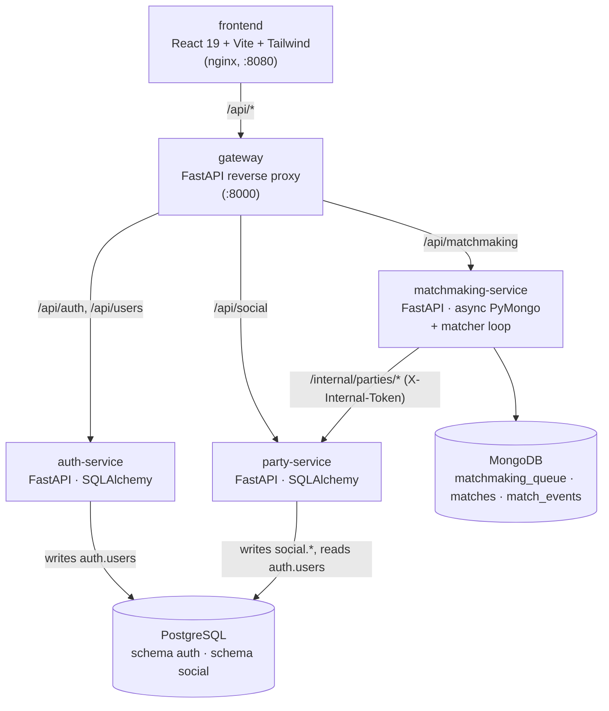
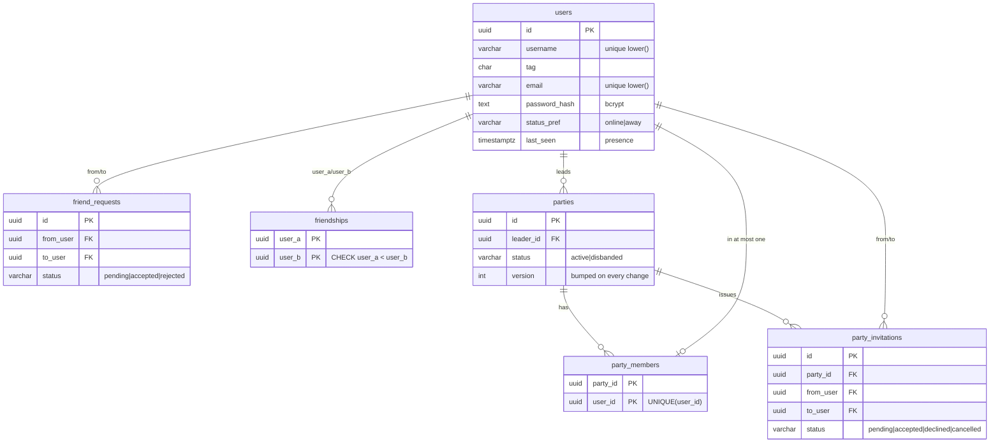

# ARCLINE

A distributed multiplayer gaming hub: accounts, friends, parties of 1–4 players, and
squad matchmaking. It is a vertical slice for a Design of Distributed Database
Management Systems course project: a React launcher in front of three FastAPI services
that use two different databases, **PostgreSQL** for relational social state and
**MongoDB** for matchmaking and match documents.

```
SIGN IN → HOME → FRIENDS → PARTY (1–4) → MATCHMAKING → MATCH FOUND → ENTER MATCH → end of demo
```

Gameplay and combat are out of scope for this phase.

---

## Architecture



| Component | Responsibility | Data |
|---|---|---|
| **frontend** | The launcher UI. Polls the gateway every 1.5 s and sends a heartbeat every 10 s. | JWT in `sessionStorage` |
| **gateway** | Single public origin. Routes by path prefix, forwards `Authorization`, and returns backend responses unchanged. Never exposes `/internal`. | – |
| **auth-service** | Register, login (bcrypt), JWT issue, profile, presence (online/away/offline). | `auth.users` |
| **party-service** | Friends, friend requests, parties, invitations, and every party rule. Answers matchmaking's validation calls. | `social.*` |
| **matchmaking-service** | Queue, cancel, status, team formation, match lifecycle (ready → enter → leave). | MongoDB |

Every service verifies the JWT itself with the shared `JWT_SECRET`, so no request needs a
round trip to auth-service. Service-to-service calls go to `/internal/*`, which checks a
shared `X-Internal-Token`. The gateway never routes those paths.

### Project layout

```
.
├── frontend/                 Vite app (+ Dockerfile, nginx.conf)
├── gateway/                  FastAPI reverse proxy
├── services/
│   ├── common/arcline_common JWT verification + structured errors (shared)
│   ├── auth-service/app/     main.py, api/, models/, schemas/, services/, db/
│   ├── party-service/app/    same layout
│   └── matchmaking-service/app/
├── db/postgres/01_schema.sql Postgres DDL (applied on first boot)
├── scripts/                  e2e.py (rule checks), bots.py (demo players), api.py
└── docker-compose.yml
```

---

## Run it

Requires Docker Desktop.

```bash
cp .env.example .env          # then replace every change-me value
docker compose up --build     # first boot applies db/postgres/01_schema.sql
```

Open **http://localhost:8080**. The gateway is also reachable at http://localhost:8000.
PostgreSQL and MongoDB are exposed on `127.0.0.1` only (ports are set in `.env`) so you can
inspect them.

Optional: bot players are real accounts that use the public API, so a 4v4 can form
with only one or two humans:

```bash
docker compose --profile demo up -d bots     # parties of 2,1,3,1 by default (BOT_PARTIES)
```

Frontend dev server with hot reload (the backend still runs in Docker):

```bash
cd frontend && npm install && npm run dev    # proxies /api to localhost:8000
```

Reset all data: `docker compose down -v`.

---

## Demo script (multiple browser tabs)

The session lives in `sessionStorage`, so **each tab is a separate signed-in user** and a
refresh keeps you signed in.

1. `docker compose --profile demo up -d --build`. This starts the stack plus 7 queued bots.
2. **Tab A**: *Create Account* as `Astra`.
3. **Tab B**: *Create Account* as `Brick`. On **Friends**, add `Astra`. The request shows as *Outgoing · pending*.
4. **Tab A**: the Friends badge shows 1. Accept. Both tabs now list each other.
5. **Tab A**: **Party**, then *Invite friend*, then Brick. The slot shows *Invite sent…* and MATCHMAKE is blocked.
6. **Tab B**: the invite toast appears. Click **Join**. Both tabs show **PARTY 2 / 4**. Brick sees
   *"Waiting for Astra to start the queue"* (the server also returns `403 NOT_LEADER`).
7. **Tab A**: **MATCHMAKE**. The queue entry goes into MongoDB. Your party of 2 plus the bots fill two
   teams and **MATCH FOUND** appears in both tabs with real teams and party grouping.
8. Ready checks tick in from the server. Click **ENTER MATCH**. This is the end of the demo.
9. Refresh either tab. You are still signed in and still in the same match or party.

Inspect the data while you go:

```bash
docker compose exec postgres sh -c 'psql -U $POSTGRES_USER -d $POSTGRES_DB'
#   select * from social.party_members;  select * from social.parties;
docker compose exec mongodb sh -c 'mongosh -u $MONGO_INITDB_ROOT_USERNAME -p $MONGO_INITDB_ROOT_PASSWORD --authenticationDatabase admin arcline'
#   db.matchmaking_queue.find({status:"WAITING"});  db.matches.find().sort({created_at:-1}).limit(1)
```

Automated rule check (stop the bots first so the queue is empty):

```bash
docker compose stop bots
pip install httpx && python scripts/e2e.py         # → ALL E2E CHECKS PASSED
cd services/matchmaking-service && python -m app.services.packing   # → packing ok
```

---

## API overview

All routes are behind the gateway at `/api`. Errors always have the shape
`{"error": {"code": "PARTY_FULL", "message": "Party is full."}}`.

| Method | Path | Notes |
|---|---|---|
| POST | `/auth/register` | `{username, email, password}` → `{token, user}` (201) |
| POST | `/auth/login` | `{login, password}`. `login` is a username or email. |
| POST | `/auth/logout` | Marks you offline. |
| GET | `/users/me` · `/users/{id}` | Profile with computed presence. |
| POST | `/users/me/heartbeat` | Keeps presence online. |
| PATCH | `/users/me` | `{status: online\|away}` |
| GET | `/social/state` | Friends, requests, party and invitations in one call (what the UI polls). |
| GET | `/social/users/search?q=` | Username prefix search. |
| GET / POST | `/social/friend-requests` | POST `{username}`; `Name#1234` is accepted. If they already asked you, this accepts. |
| POST | `/social/friend-requests/{id}/accept` · `/reject` | |
| GET | `/social/friends` | |
| GET / POST | `/social/party` | POST is idempotent: it creates a party or returns your existing one. |
| POST | `/social/party/invitations` | `{user_id}`. Creates your party if needed. |
| DELETE | `/social/party/invitations/{id}` | Cancel (sender or leader only). |
| POST | `/social/party/leave` | Leader leaves → the longest-standing member is promoted. Empty → disbanded. |
| DELETE | `/social/party/members/{user_id}` | Kick (leader only). |
| GET | `/social/invitations` | Invitations sent to you. |
| POST | `/social/invitations/{id}/accept` · `/decline` | Accepting leaves your old party in the same transaction. |
| POST / DELETE | `/matchmaking/queue` | POST `{mode: squad\|random}` (leader only, idempotent). DELETE (any member, idempotent). |
| GET | `/matchmaking/status` | `idle` · `searching` (with live team formation) · `found` · `entered` |
| POST | `/matchmaking/matches/{id}/ready` · `/enter` · `/leave` | Ready check → enter (needs all ready) → back to hub. |

Status codes: `400` invalid request · `401` bad or missing JWT · `403` not allowed (not leader,
not friends) · `404` not found · `409` conflicting state (full, already queued, pending
invites, in a match) · `502/503` a service is unreachable.

---

## PostgreSQL schema

`db/postgres/01_schema.sql` holds the full DDL.



The constraints do the real work:

- `UNIQUE (party_members.user_id)`: a user is in **at most one party**.
- A `BEFORE INSERT` trigger on `party_members` rejects a 5th member, backing up the service's check.
- Partial unique indexes: one *pending* friend request per direction, and one *pending* invite
  per (party, user).
- `friendships` stores each undirected pair once (`CHECK user_a < user_b`).
- `CHECK` constraints on the username format, tag format and every status enum.

Party tables reference `auth.users` by foreign key and store **no copies** of user data.

## MongoDB collections

```js
// matchmaking_queue: one document per queued party
{ queue_id, party_id, party_version, leader_id, mode: "SQUAD"|"RANDOM",
  players: [{id, name, tag}], player_ids: [...], size: 1..4,
  joined_at, status: "WAITING"|"MATCHED"|"CANCELLED"|"INVALIDATED", match_id? }
// unique partial index {party_id} where status = "WAITING"  → a party cannot queue twice

// matches
{ match_id, mode, status: "FOUND"|"IN_PROGRESS"|"COMPLETED"|"CANCELLED",
  teams: [ { players: [{id,name,tag}], parties: [{party_id, players: [ids]}] }, {...} ],
  player_ids, ready: [ids], entered: [ids], left: [ids], created_at, ended_at? }

// match_events: append-only log, ready for future gameplay events
{ match_id, type: "MATCH_CREATED"|"PLAYER_READY"|"PLAYER_ENTERED"|"PLAYER_LEFT"|"MATCH_COMPLETED"|"MATCH_CANCELLED",
  user_id?, at, data }
```

### Matching algorithm (`matchmaking-service/app/services/packing.py`)

This is deterministic and has no MMR. Parties are never split. The oldest waiting party
anchors a team, which is completed by the combination of later parties that adds up to
exactly 4 players, preferring the **fewest** parties and then the earliest. A full premade
of 4 is a team on its own. Two full teams, in queue order, make a match. Random mode is
solo only, so it groups 8 solos. The same function drives the *"Your team x / 4"* preview on
the searching screen, so the preview always matches the team you will actually get.

---

## Distributed database design

### Why PostgreSQL for users, friends and parties

This data is relational and full of invariants: "at most one party per user", "at most 4
members", "only friends can be invited", "a friendship is mutual". Those are foreign keys,
unique constraints, `CHECK`s and a trigger, enforced by the database no matter which code
path writes. Joining a party means changing several rows at once (the invite, the old
party, the new party, membership), so it needs **ACID transactions** and **row locks**.

### Why MongoDB for matchmaking and matches

Queue entries and matches are short-lived, written often, and document-shaped: a match
is a nested structure of teams → parties → players that is always read whole. Storing it
as one document means reading a match is a single lookup with no joins. The schema can
also grow (per-player stats, events, server assignment) without migrations, and
`match_events` is a natural append-only log for the future game service. Denormalizing
player names into queue and match documents is deliberate: those documents are snapshots
of who was matched, not the source of truth for users.

### Consistency boundaries

There is **no distributed transaction** between PostgreSQL and MongoDB, and the system
does not pretend otherwise.

- **PostgreSQL is authoritative** for users, friendships and party membership.
- **MongoDB is authoritative** only for queue and match state, which is *derived* from a
  party snapshot.

The gap between the two is closed with **optimistic validation**:

1. On enqueue, matchmaking asks party-service (HTTP, `/internal/parties/for-queue/{user}`)
   for a fresh snapshot: members, leader, `version`, pending invites. It checks
   *leader-only*, *no pending invites*, *random = solo*, and then stores `party_version` in
   the queue document.
2. Every membership or leader change in Postgres bumps `parties.version` inside the same
   transaction.
3. Every matcher tick (about 1 s) sends one batch call, `/internal/parties/validate`, with
   all waiting `(party_id, version)` pairs. Parties whose version changed, that were
   disbanded, or that have a member whose heartbeat went stale are marked `INVALIDATED` and
   left out of matching. **No match is ever formed from unverified state.** If party-service
   is down, the tick fails and forms nothing.
4. Queue entries are claimed with a conditional `update_many({status: "WAITING"})`, and the
   claim counts only if `modified_count` equals the number of entries. A concurrent cancel
   makes the claim fail, and the partially claimed entries are released. If inserting the
   match document fails, the claimed entries are put back to `WAITING` (a compensating
   action). This avoids needing a MongoDB replica set for multi-document transactions.
5. A ready check that isn't completed within `READY_TIMEOUT_S` cancels the match, so an
   abandoned client can't block the other players forever.

The result is eventual consistency between the stores with a window of at most one
matcher tick. A party that changes while queued is dropped from the queue before it could
be matched.

### Consistency inside PostgreSQL

Accepting an invite, leaving, kicking and inviting each run in **one transaction** that
locks the party row(s) with `SELECT … FOR UPDATE`. When a user switches parties, both rows
are locked **in id order** so two users swapping parties can't deadlock. The trigger and
unique constraints are the backstop if application code ever forgets a check.

### Known limits (deliberate for this phase)

- Real-time updates use HTTP polling (1.5 s). SSE or WebSockets belong with the future game service.
- One matchmaking replica: the matcher loop runs in-process. Claims are already
  conditional, but running several replicas would also need a leader lock.
- No MMR, region or latency in matchmaking. The region label in the UI is cosmetic.
- The activity feed on the home screen is per client and not persisted.
